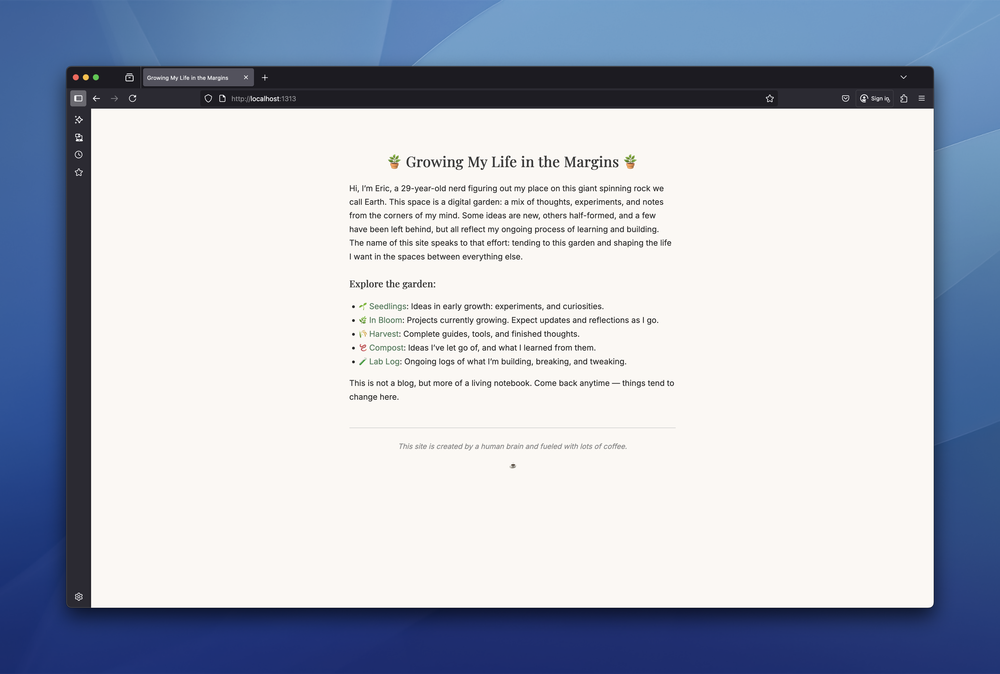

# Building My Life in the Margins

This is the source for my personal site: a growing digital garden built with [Hugo](https://gohugo.io/).

I wanted a space to write and document what I’ve been building, thinking about, and sometimes letting go of. Not a blog. Not a portfolio. Just a notebook that lives on the web. After stumbling upon [Maggie Appleton's website](https://maggieappleton.com/garden-history/) I was introduced to the concept of a digital garden and it quickly resonated with me. 

According to Maggie:

"A garden is a collection of evolving ideas that aren’t strictly organised by their publication date. They’re inherently exploratory – notes are linked through contextual associations. They aren’t refined or complete - notes are published as half-finished thoughts that will grow and evolve over time. They’re less rigid, less performative, and less perfect than the personal websites we’re used to seeing."

"It harkens back to the early days of the web when people had fewer notions of how websites “should be.” It’s an ethos that is both classically old and newly imagined."

## 🌱 Why I’m Doing This

I’ve been venturing into the [IndieWeb](https://indieweb.org/) movement — the quiet belief that having a small, personal site still matters. Especially in an internet full of algorithmic noise and AI-generated content.

I don’t want to wait around for platforms to decide what I can or can’t share. And I don’t want to build a site that’s bloated with trackers or scripts.

 I want something:

- Fast
- Lightweight
- Easy to read
- Easy to maintain

## 🏗️ What I'm Currently Building
- [x] Design
- [ ] Copying content over from previous blogging platform [Pika](https://pika.page)
- [ ] Provision Virtual Private Server for hosting 

---

