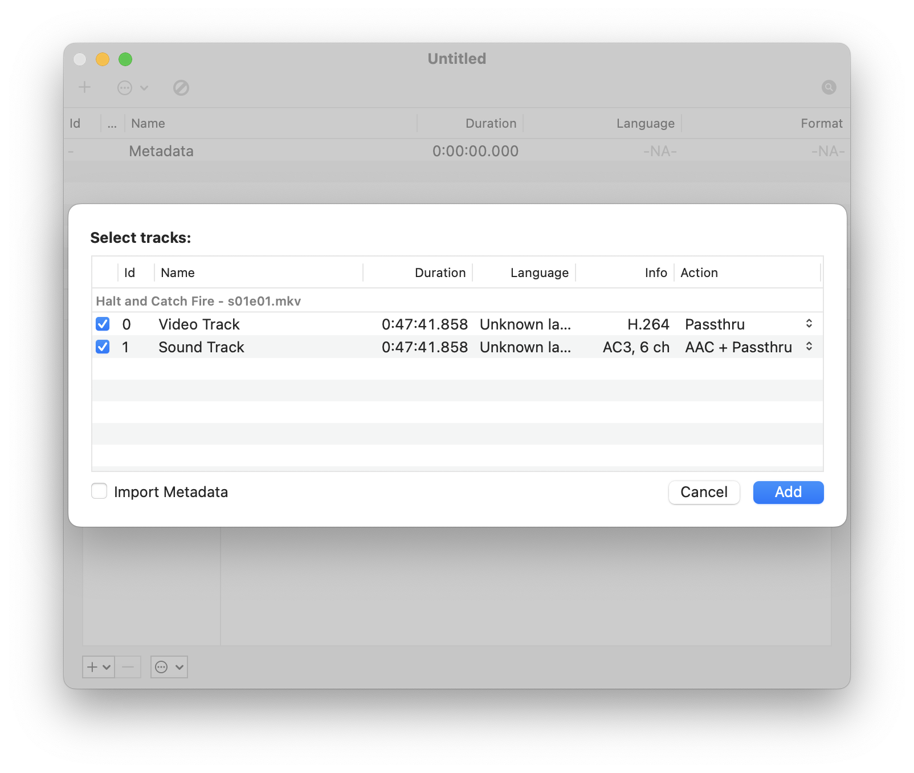

I’ve been in the process of digitizing all my DVDs of movies and tv shows. After I have the files, I like to embed all the relevant metadata into the file itself so I’m able to move it to any self hosted media service without having to rely on third party metadata indexers.

My application of choice for this task is called [Subler](https://subler.org/) which allows me to search various databases for metadata, embed that data, optimize for handheld devices, and export.

The process of a few movies or shows is fairly straightforward with a couple clicks and export, however when you’re trying to work with an entire tv series you end up having to do the same clicks over and over.

This is where automation comes into play. I chose to work with AppleScript which is a scripting language created by Apple that, “allows users to directly control scriptable Macintosh applications, as well as parts of macOS itself.”

I created a script that utilizes emulating keyboard shortcuts for the entire workflow. I came across this amazing [web page](https://eastmanreference.com/complete-list-of-applescript-key-codes) created by Christopher Kielty that shows all the corresponding key codes.

Here’s a look at the final AppleScript file:

Here's a preview of the workflow in action:

This is what the workflow looks like in Subler if you were to execute it manually:

1. Importing Files

2. Search and Adding Metadata

3. Adding Artwork

4. Exporting

Having the ability to click a single button and have the entire process execute without having to lift a finger makes going through many tv series much more manageable.

The full Subler.scpt file is available for download over on my [GitHub repo](https://github.com/its-ericjones/AppleScript/tree/main/Subler).